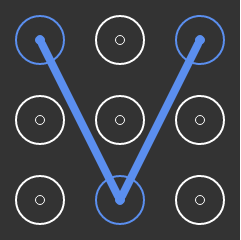

# NineBox
Nine Box —— 九宫格密码锁（ie内核完善中）

###options###
```html
showMoveLine: true,//是否显示鼠标移动路径
zindex: 100,//九宫格z-index属性
roundRadii: 25,//圆环半径
backgroundColor: "#333",//背景色
color: "#FFFFFF",//圆环颜色
nineBox: [1, 8, 3],//密码数组，索引从1开始
errorColor: '#FF0000',//解锁失败锁环颜色
boxTimer: 1000,//错误时清除记录间隔
lineColor: '#5B8FEF',//线颜色
lineWidth: 26,//线宽度
width: 240,//容器宽度
height: 240,//容器高度
onError: function () {
},//密码错误执行的操作
onSuc: function () {
}//成功解锁执行的操作
```

###snapshot###
